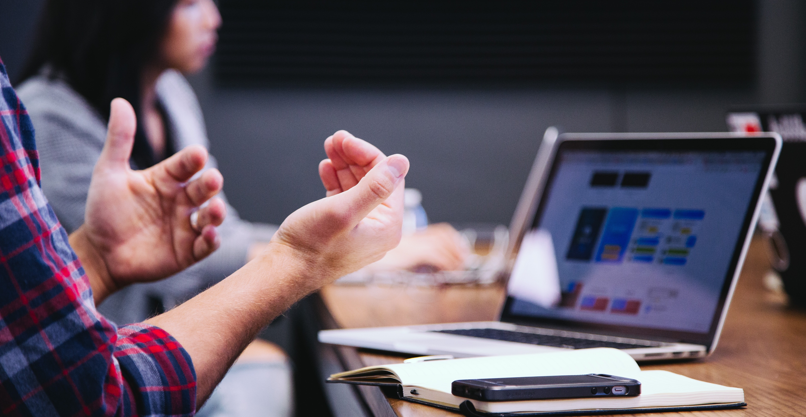

# The Data Science Lifecycle

> Photo by <a href="https://unsplash.com/@headwayio?utm_source=unsplash&utm_medium=referral&utm_content=creditCopyText">Headway</a> on <a href="https://unsplash.com/s/photos/communication?utm_source=unsplash&utm_medium=referral&utm_content=creditCopyText">Unsplash</a>
  
In these lessons, you'll explore some of the aspects of the Data Science lifecycle, including analysis and communication around data.

### Topics

1. [Introduction](Introduction%20to%20the%20Data%20Science%20Lifecycle.md)
2. [Analyzing](The%20Data%20Science%20Lifecycle%20Analyzing.md)
3. [Communication](The%20Data%20Science%20Lifecycle%20Communication.md)

### Credits

These lessons were written with ❤️ by [Jalen McGee](https://twitter.com/JalenMCG) and [Jasmine Greenaway](https://twitter.com/paladique)
